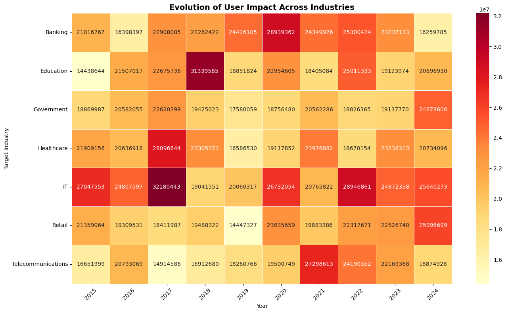
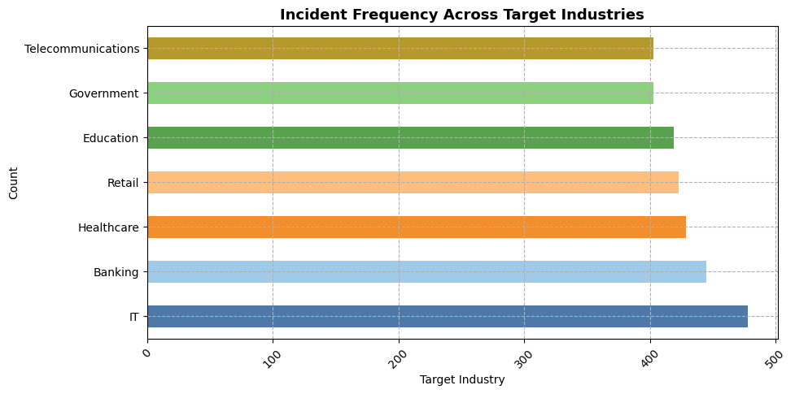
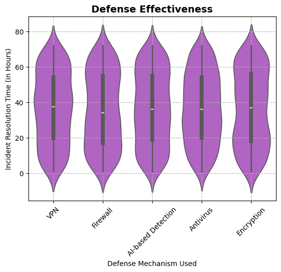
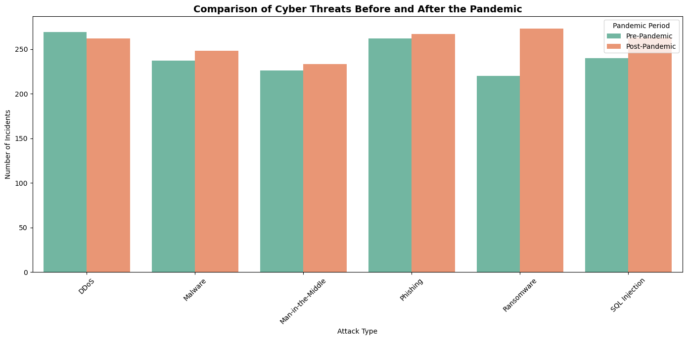
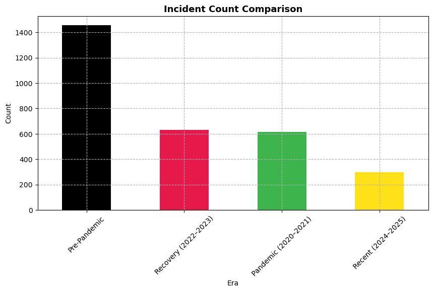
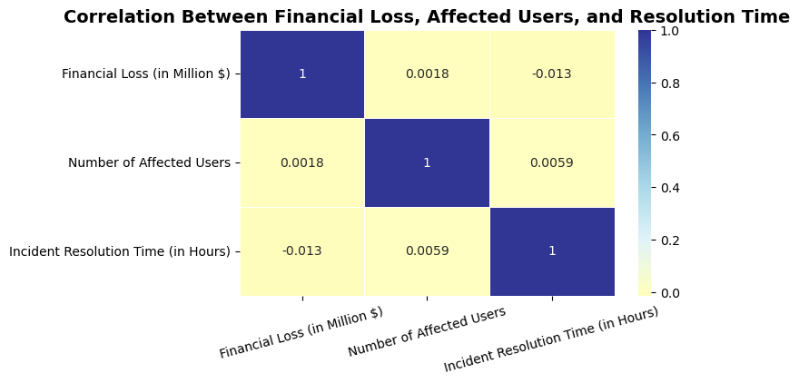

# Global Cybersecurity Incident Analysis (2015–2024)

---

## Key Highlights

- Analyzed 3,000+ global cybersecurity incidents (2015–2024)
- Identified increase in attack severity despite decline in incident frequency
- Discovered VPN-based defenses showed highest failure rates during remote-work expansion
- Applied statistical testing (ANOVA, correlation, regression) to validate patterns

---

## Business Impact

This analysis enables organizations to:
- Shift focus from incident frequency to severity-based risk assessment  
- Prioritize cybersecurity investments based on financial impact and exposure  
- Strengthen defenses by targeting high-frequency vulnerabilities (patching, phishing)  

---

## 1. Problem Statement / Business Objective

Cybersecurity incidents are often evaluated based on frequency, but frequency alone does not capture true risk.  
This project analyzes global cybersecurity incident data (2015–2024) to understand:

- What drives cybersecurity risk across industries and regions  
- Whether incident frequency reflects vulnerability or reporting behavior  
- How attack patterns, financial impact, and defense mechanisms evolved over time  
- Which factors meaningfully influence financial loss and user impact  

---

## 2. Dataset Description

The dataset (`Global_Cybersecurity_Threats.csv`) contains multi-year incident-level data across countries, industries, and attack types.

**Key features include:**
- Country, Year  
- Attack Type (Ransomware, DDoS, SQL Injection, etc.)  
- Target Industry (IT, Healthcare, Banking, etc.)  
- Financial Loss (Million $)  
- Number of Affected Users  
- Security Vulnerability Type  
- Defense Mechanism Used  
- Incident Resolution Time  

**Feature engineering performed:**
- Era segmentation (Pre-Pandemic, Pandemic, Recovery, Recent)  
- Resolution time buckets  
- Loss per user metric  

---

## 3. Data Cleaning & Preparation

- Processed and standardized 3,000+ records using **Python (Pandas, NumPy)**  
- Handled missing values, removed duplicates, and resolved inconsistent labels  
- Transformed data into analysis-ready format with engineered features for temporal and impact-based comparisons  

---

## 4. Analysis Performed

- Conducted **Exploratory Data Analysis (EDA)** across attack types, industries, and geographies  
- Performed **bivariate and multivariate analysis** to evaluate relationships between vulnerabilities, defenses, and financial impact  
- Analyzed **temporal trends (2015–2024)** comparing pre-pandemic, pandemic, and recovery phases  
- Applied statistical techniques using **SciPy**:
  - Linear Regression → trend validation  
  - ANOVA → variation in financial loss across attack types  
  - Pearson Correlation → relationship between affected users and financial loss  

---

## 5. Tools & Technologies Used

- **Python (Pandas, NumPy)** – Data cleaning and feature engineering  
- **Matplotlib, Plotly** – Data visualization  
- **SciPy** – Statistical testing  
- **Jupyter Notebook** – Analysis environment  

---

## 6. Key Insights

### Pandemic Impact on Cybersecurity

- Incident frequency declined during the pandemic, but severity increased with higher financial losses and user impact  



---

### Industry Risk Exposure

- IT, Banking, Healthcare, and Education showed the highest exposure due to centralized and sensitive data structures  



---

### Vulnerability Patterns

- Majority of breaches were driven by unpatched systems and human error rather than sophisticated attacks  



---

### Defense Effectiveness

- VPN-based security showed the highest failure rates during remote work expansion, contributing to increased losses  



---

## 7. Visualizations

### Cybersecurity Trends Over Time


### Financial Loss vs User Impact


These visualizations help translate complex data into actionable insights for decision-making.

---

## 8. Conclusion

Cybersecurity risk is driven more by severity than frequency.  
Organizations relying only on incident counts may underestimate true risk exposure.  
Focusing on patch management, user awareness, and modern access control systems is critical to reducing impact.

---

## 9. Extensions

- Analysis can be scaled using SQL for large datasets and querying  
- Insights can be operationalized through Power BI dashboards for real-time monitoring  

---

## 10. How to Run / Reproduce

1. Clone the repository  
2. Open the Jupyter Notebook (`.ipynb`)  
3. Install required libraries:

```bash
pip install pandas numpy matplotlib plotly scipy
