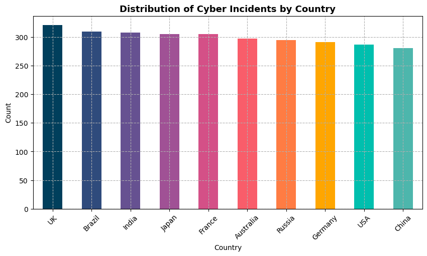
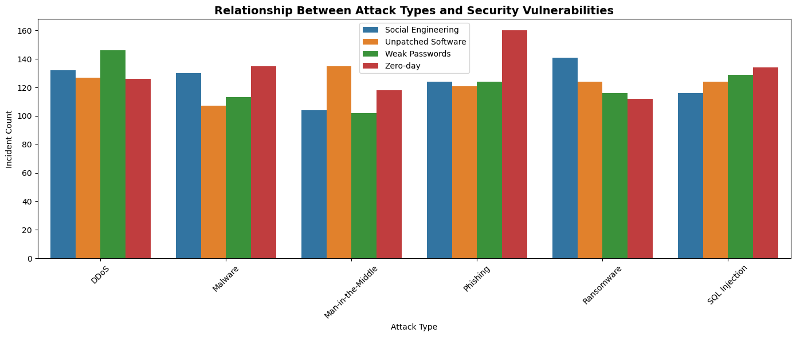
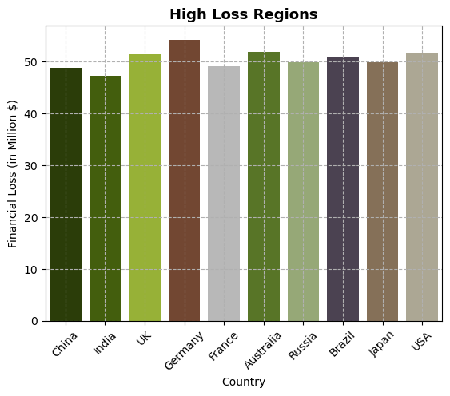
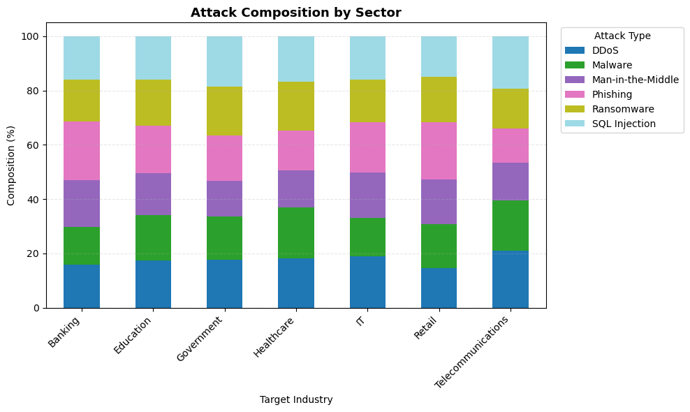
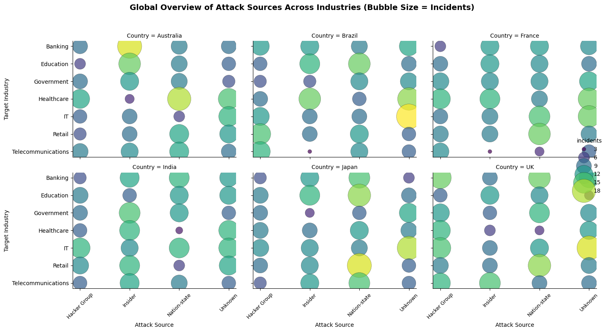
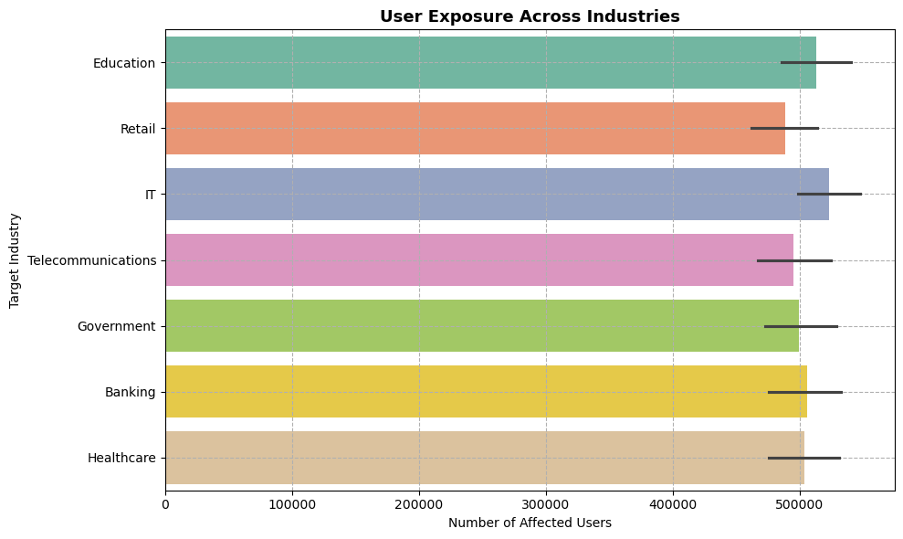
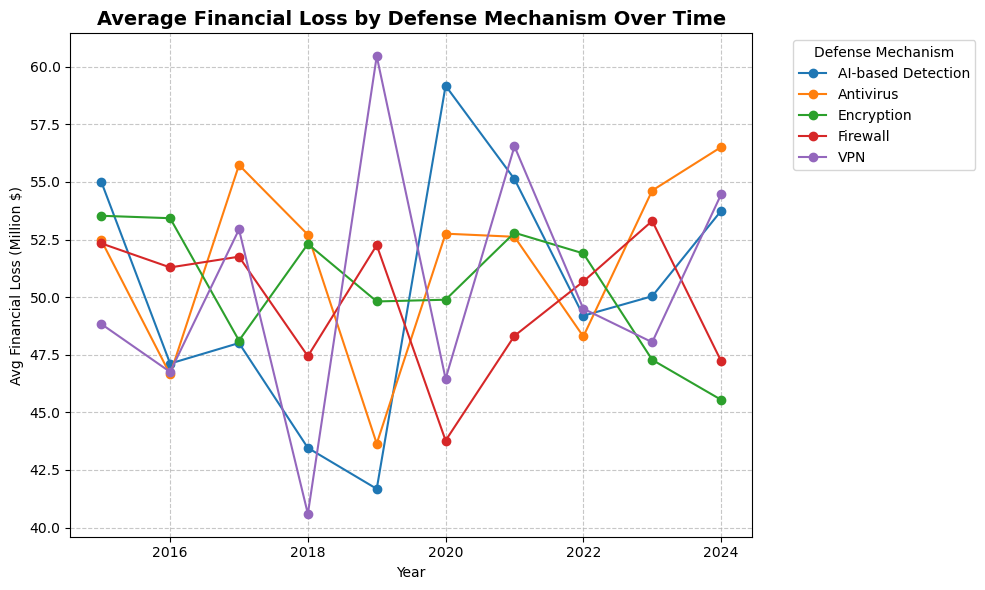
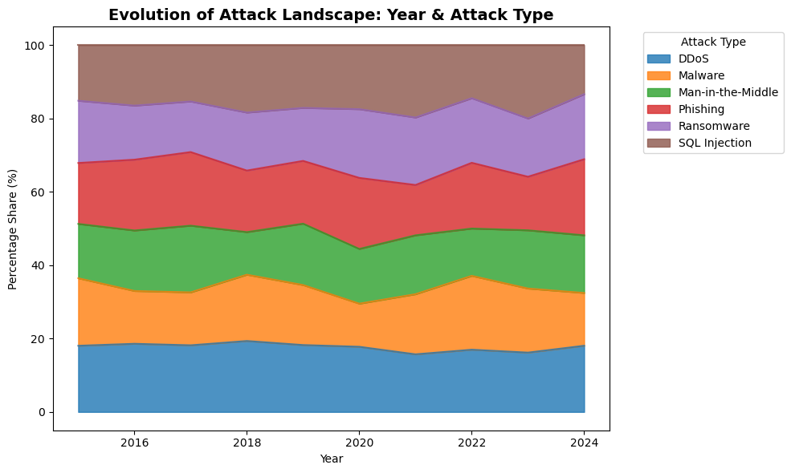

# Global Cybersecurity Incident Analysis (2015-2024)

> *Ten years of breach data. What actually drives cyber risk, and what doesn't.*


---

## The question this project answers

When a country reports a lot of cyberattacks, does that mean its defenses are weak, or that it's more transparent? When ransomware spiked during the pandemic, was that about opportunity, desperation, or both? And which defense mechanisms actually hold up under pressure?

This project works through 10 years of global cybersecurity incident data (2015-2024) to find out. It goes beyond counting attacks and uses statistical testing to separate real patterns from noise.

---

## What I found

The most counterintuitive finding comes first, because it reframes everything else:

**The pandemic did not cause more attacks. It made each one hurt more.**

Incident frequency actually dropped during 2020-2021, but financial losses and user impact surged. Rapid remote-work expansion created new exposure faster than security teams could adapt. The chart below makes this visible:


Other findings that cut against the obvious:

- **High incident counts can mean good transparency, not weak defense.** The UK, Brazil, Japan, and Australia report high volumes, but this reflects digital scale and open reporting norms, not vulnerability. The US and Germany show lower counts partly due to centralized monitoring and disclosure restrictions.



- **VPNs, the pandemic-era default, were the biggest defense failure.** VPN-dependent setups showed the highest financial losses during the remote-work period. The line chart below tracks average financial loss by defense mechanism over time. The VPN spike around 2019-2020 stands out clearly.


- **Most breaches still trace back to two things:** unpatched software and human behaviour (phishing, weak passwords). Not sophisticated attackers. Unglamorous causes with unglamorous fixes.


- **Ransomware exploded post-2020. SQL injection never went away.** SQL injection has been consistent for a decade. Ransomware surged after 2020, driven by remote operational pressure and the leverage it provides against zero-downtime industries like healthcare.



---

## Dataset

`Global_Cybersecurity_Threats.csv` covering 2015-2024 across countries, industries, and attack types.

| Column | Description |
|---|---|
| Country | Where the incident occurred |
| Year | Year of occurrence |
| Attack Type | Malware, DDoS, Ransomware, Phishing, SQL Injection, etc. |
| Target Industry | Finance, Healthcare, IT, Retail, Education, etc. |
| Financial Loss (Million $) | Estimated monetary impact |
| Number of Affected Users | Total users affected |
| Attack Source | Internal or external |
| Security Vulnerability Type | Weak passwords, unpatched software, social engineering, etc. |
| Defense Mechanism Used | Firewall, VPN, AI detection, encryption, etc. |
| Incident Resolution Time (Hours) | Time to contain and resolve |

**Derived features engineered during analysis:**

| Feature | Logic |
|---|---|
| Era | Pre-Pandemic / Pandemic / Recovery / Recent |
| Resolution Bucket | 24h or less / 24-72h / over 72h |
| Loss per User | Financial Loss divided by Affected Users |

---

## Analysis approach

The notebook works through four layers:

**1. Univariate** - distributions of attack types, targeted industries, and affected countries. Establishes what is common vs rare.

**2. Bivariate** - relationships between variables: which attack types correlate with which vulnerabilities, how defense mechanisms relate to resolution time, financial loss by country and sector.



**3. Temporal and multivariate** - evolution of threats from 2015-2024, pre vs post-pandemic comparison, heatmaps across sectors and geographies.




**4. Statistical validation** - three tests to confirm the patterns are real:

| Test | Variables | Purpose |
|---|---|---|
| Linear Regression | Year vs Incident Count | Is the trend over time statistically significant? |
| ANOVA | Attack Type vs Financial Loss | Do losses differ meaningfully across attack types? |
| Pearson Correlation | Affected Users vs Financial Loss | Do larger-scale attacks actually cost more? |


---

## Key findings by area

### Who gets hit hardest

IT, Banking, Healthcare, and Education face the highest exposure, all for the same reason: centralized, identity-linked data that is widely accessed. Healthcare is uniquely vulnerable to ransomware because of its zero-downtime dependency. Education tends to have large, distributed user bases with lower security budgets.




### What attackers actually exploit

| Vulnerability | Primary attack vector |
|---|---|
| Unpatched software | Ransomware, MITM |
| Weak or reused passwords | Botnet-driven DDoS |
| Human trust via phishing | Credential theft, zero-day entry |

The pattern: most breaches don't require sophisticated attackers. They require inattentive administrators and undertrained users.

### How defenses compare



| Mechanism | Performance | Notes |
|---|---|---|
| Firewalls and Encryption | Consistently effective | Strong perimeter and data-layer protection |
| VPN and early AI detection | Poor during 2020-2021 | Overwhelmed by sudden scale of remote access |
| Traditional antivirus | Declining | Ineffective against adaptive or novel threats |

### Attack composition by sector



### The pandemic era shift

Frequency went down. Severity went up. As organizations digitized rapidly without adequate preparation, each incident that did occur had disproportionate impact. The recovery period (2022-2023) shows stabilization as security postures caught up.



---

## Strategic recommendations

**1. Fix the basics before buying new tools.**
Unpatched software and phishing account for the majority of successful breaches in this dataset. Automated patch scheduling and phishing simulation programmes close the highest-volume attack vectors faster than any perimeter tool.

**2. Healthcare and Education need dedicated security baselines.**
Both sectors show high user exposure relative to typical security investment. For Healthcare especially, offline backups and access segmentation should be treated as operational requirements, not optional hardening.

**3. Audit your VPN dependency.**
VPN-first remote access failed under pandemic-era conditions. Organizations still relying primarily on VPN should evaluate Zero Trust Network Access (ZTNA), which limits lateral movement even after an initial breach.

**4. Measure severity, not just frequency.**
Incidents are stabilizing in count but not in impact. Security teams should track mean financial loss per incident and mean resolution time as primary KPIs, not total incident count, to accurately reflect the current threat landscape.

---

## Tech stack

| Tool | Role |
|---|---|
| Python (Pandas, NumPy) | Data cleaning, feature engineering |
| Matplotlib, Plotly | Visualizations |
| SciPy | Statistical tests (regression, ANOVA, correlation) |
| Jupyter Notebook | Analysis environment and documentation |

---

## Repository structure

```
├── Global-Cybersecurity-Incident-Analysis.ipynb
├── Global_Cybersecurity_Threats.csv
├── Cybersecurity-project-images/
└── README.md
```

---

## About

I'm Sreelakshmi, a data analyst with a background in engineering and an MBA, focused on turning raw data into decisions. This project is part of a portfolio built around SQL analytics, Python-based EDA, and Power BI dashboards.

[LinkedIn](https://www.linkedin.com/in/sreelakshmithilakan/) · [Notion Portfolio](https://www.notion.so/Sreelakshmi-Thilakan-Data-Stories-2bb3af78860580f49b1fd96f8153bb49)
